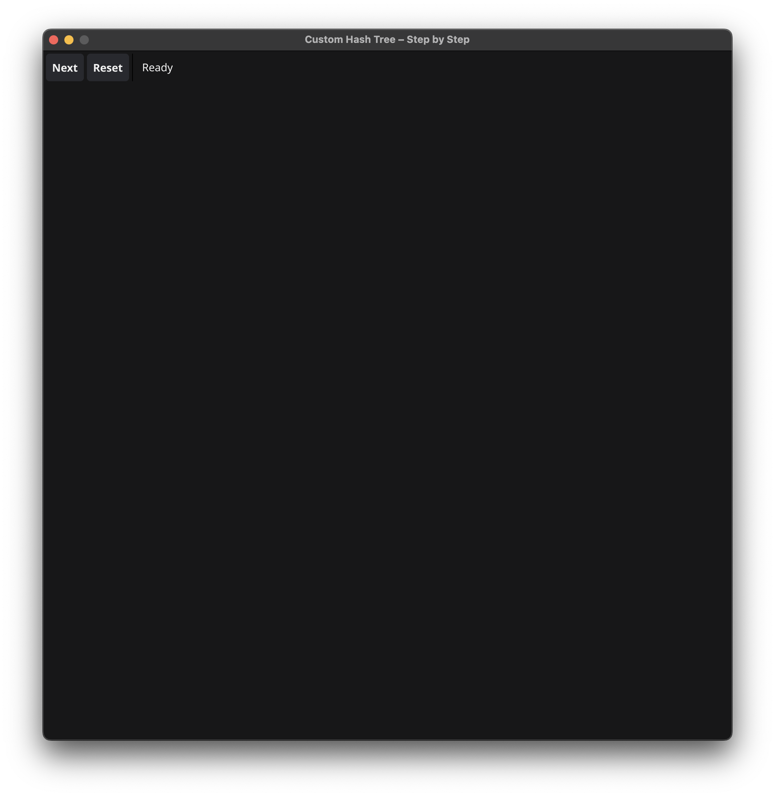
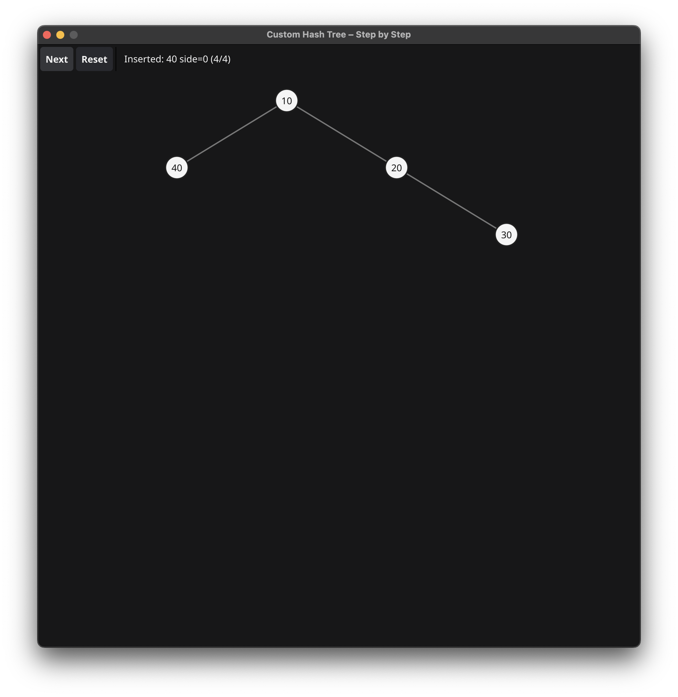

# TreeHash 🌳

**TreeHash** is an experimental visualization tool for building and exploring custom binary trees.  
It uses [Go](https://golang.org/) with [Fyne](https://fyne.io/) to render trees step by step, based on insertion rules stored in a hash map.

---

### Features
- Insert nodes step by step (manual control).
- Visualization of **left/right** insertions with custom rules (`hash map`).
- Clean and simple UI powered by Fyne.
- Fixed-size macOS app bundle (`.app`) packaging support.

### Requirements
- Go 1.21+  
- Fyne toolkit (`go get fyne.io/fyne/v2`)  
- macOS (tested on Apple Silicon M1)  

### Run locally
```bash
make run
```

### Build & Package for MacOS
```bash
make build

make package
open tree.app
```

### Screenshot


